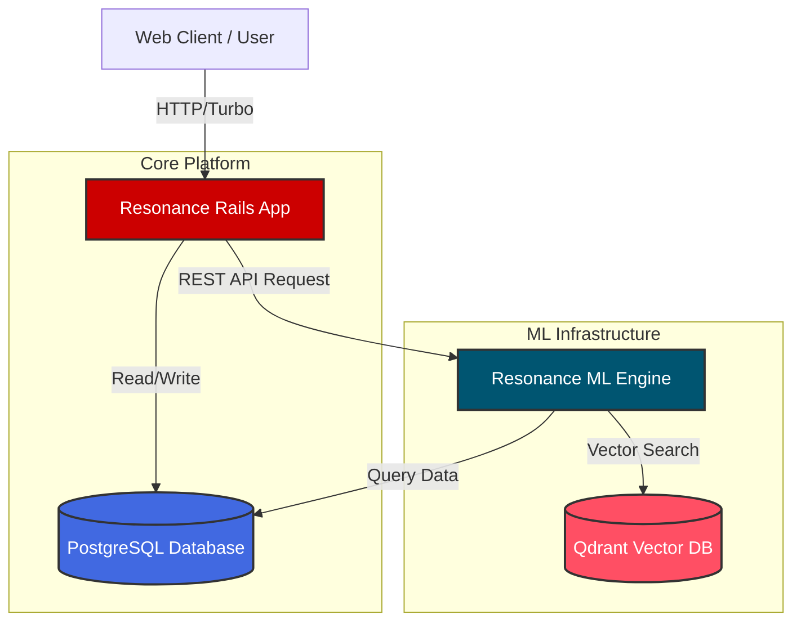

<div align="center">
  <h1>🎵 Resonance</h1>
  <p><b>A Context-Aware Music Platform & Recommendation Engine</b></p>

  [](https://rubyonrails.org/)
  [](https://fastapi.tiangolo.com/)
  [](https://pytorch.org/)
  [](https://www.postgresql.org/)
  [](https://www.docker.com/)
</div>

---

## 📖 Overview

**Resonance** is a modern, microservices-oriented music platform designed to provide highly contextual and personalized music recommendations. It bridges the gap between traditional monolithic application state management and advanced machine learning infrastructure.

The project is split into two primary services:
1. **`resonance-rails`**: The core application backend handling user authentication, library management, playlists, and the web interface.
2. **`resonance-ml`**: A dedicated AI/ML microservice built with Python and FastAPI that generates contextual track recommendations using vector embeddings.

---

## 🎯 Core Competencies & Skills Demonstrated

This repository is built to showcase a full-stack, AI-integrated approach to modern software engineering. 

### 🧠 Machine Learning & AI
* **Vector Search & Embeddings**: Utilizes `Qdrant` and `FAISS` for lightning-fast similarity searches based on track embeddings.
* **Transformer Models**: Integrates `sentence-transformers` for generating dense vector representations of musical metadata.
* **ML Microservice**: Deploys a dedicated `FastAPI` application to serve model predictions and handle intensive computational workloads away from the main web thread.

### 💻 Software Development & Architecture
* **Microservices Pattern**: Decouples the ML heavy-lifting from the web server, allowing independent scaling and language optimization (Python for ML, Ruby for web).
* **Containerization**: Orchestrated using `docker-compose` to seamlessly link the PostgreSQL database with the application services, ensuring local development parity.
* **Modern Web Stack**: Utilizes Hotwire (Turbo/Stimulus) in Rails to provide a Single Page Application (SPA) feel without the overhead of a heavy JavaScript framework.

### 🔌 API Design & Usage
* **RESTful Communication**: The Rails backend consumes the ML service's recommendations via cleanly defined REST API endpoints (`/api/v1/recommendations`).
* **OpenAPI Standard**: The ML engine self-documents via FastAPI's automatic Swagger/OpenAPI integration, ensuring type-safe and clear contracts between services.

---

## 🏗️ System Architecture



---

## 🚀 Getting Started

To run Resonance locally, ensure you have Docker, Ruby (3.x), and Python (3.12+) installed.

### 1. Database Setup
Spin up the PostgreSQL database using Docker Compose:
```bash
docker-compose up -d
```

### 2. Rails Application
Navigate to the Rails directory and start the server:
```bash
cd resonance-rails
bundle install
rails db:setup
bin/dev
```

### 3. ML Engine
In a separate terminal, start the FastAPI recommendation service:
```bash
cd resonance-ml
pip install uv
uv sync
uv run uvicorn app.main:app --reload --port 8000
```

---

## 📚 Project Structure

* `/resonance-rails`: The Ruby on Rails web application.
* `/resonance-ml`: The Python FastAPI machine learning service.
* `docker-compose.yml`: Infrastructure orchestration.

---

> **Note for Recruiters / Reviewers:**  
> This project emphasizes clean architectural boundaries, leveraging the right tool for the job (Ruby on Rails for rapid web development and robust ORM, alongside Python for its unmatched ML ecosystem). Please explore the `resonance-ml/app/api` and `resonance-rails/app/controllers` directories to see how these services interact.